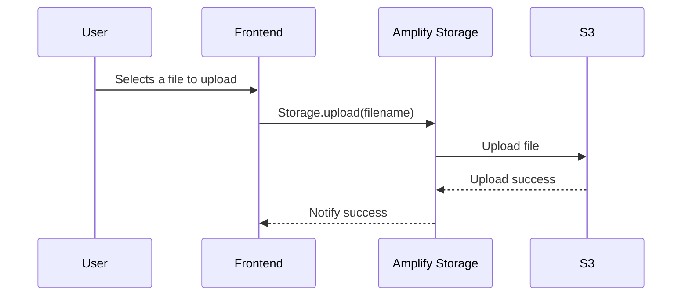
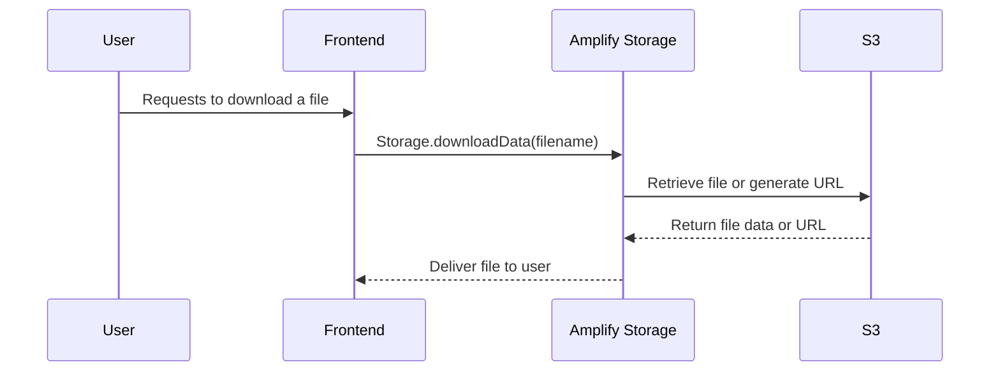
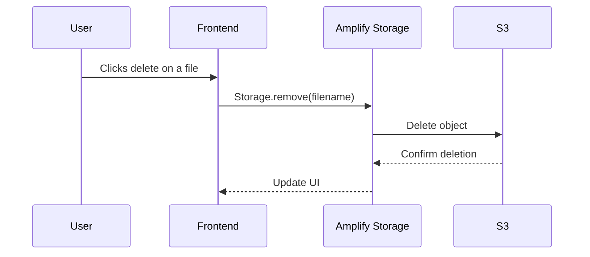
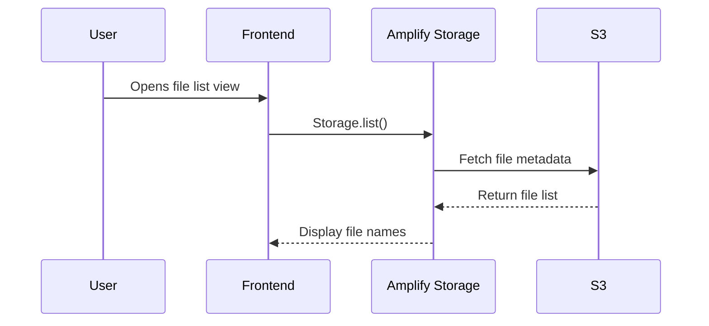

# Cloud Storage Manager

This is a cloud storage file manager built with **React+Vite** and **AWS Amplify**.

## Table of Contents

1. [Project Overview](#project-overview)
2. [Recording](#recording)
3. [Features](#features)
4. [Technologies Used](#technologies-used)
4. [Getting Started](#getting-started)
---

## Project Overview
This project is a fully functional **cloud-based file manager** built with **React** and **AWS Amplify**, designed to mimic a lightweight version of a service like Google Drive or Dropbox. It allows users to seamlessly **upload**, **view**, **download**, and **delete files** stored in an **Amazon S3 bucket**, all through a clean and intuitive web interface.


---
## Recording

https://github.com/user-attachments/assets/fe2fe148-1dbe-48c8-977c-f73c1fd10c7d


---
## Features

- Integration with AWS Amplify and S3
- Live file listing with automatic updates
- Secure file uploads with full S3 path control
- List all files with size and modified date
- Delete files from the S3 bucket
- Pre-signed URLs for safe downloading
- Responsive UI for ease of navigation and clarity

---
##  Technologies Used

- React
- TypeScript
- CSS
- IAM
- AWS CLI
- Sandbox Environment
- AWS Amplify (Storage module)
- Amazon S3

## 🔧 How It Works

This project is a cloud storage solution built using **AWS Amplify** and **Amazon S3**, enabling users to securely upload, download, delete, and list files directly from the frontend. There is no authentication layer, so all interactions with S3 are handled through **Amplify’s Storage module**, typically using public or unrestricted access permissions configured in the Amplify backend.

### ⚙️ Components

- **Frontend Client**: Interacts with Amplify Storage API
- **AWS Amplify**: Provides simplified access to AWS services
- **Amazon S3**: Stores user files
- *(No authentication layer is present in this project)*

---

## 📤 Uploading Files



---

## 📥 Downloading Files



---

## ❌ Deleting Files



---

## 📂 Listing Files



---

## 🧭 Summary

- **All operations** (upload, download, delete, list) are done using Amplify's `Storage` API.
- **No authentication** is required; the S3 bucket should be configured for either:
  - Public access, or
  - Fine-grained access via Amplify Storage rules (e.g., guest access enabled)
- **S3 acts as the primary backend**, with Amplify serving as a bridge to simplify SDK usage in the frontend.

---


---
## Getting Started

```bash
# Clone the repository
git clone https://github.com/your-username/cloud-dashboard.git

# Install dependencies
npm install

# Start the development server
npm run dev
